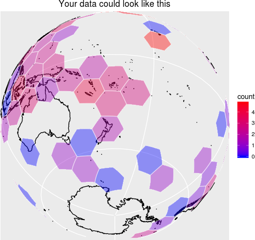

[](https://doi.org/10.5281/zenodo.1322866)

dggridR: Discrete Global Grids for R
====================================

_Spatial Analysis Done Right_

You want to do spatial statistics, and it's going to involve binning.

Binning with a rectangular grid introduces messy distortions. At the macro-scale
using a rectangular grid does things like making Greenland bigger than the
United States and Antarctica the largest continent.


But this kind of distortion is present no matter what the resolution is; in
fact, it shows up whenever you project a sphere onto a plane.

What you want are bins of equal size, regardless of where they are on the globe,
regardless of their resolution.

dggridR solves this problem.

dggridR builds discrete global grids which partition the surface of the Earth
into hexagonal, triangular, or diamond cells, **all of which have the same
size.** (There are some minor caveats which are detailed in the vignettes.)



(Naturally, you can use _much_ smaller cells than those shown in the image above.)

This package includes everything you need to make spatial binning great again.

Many details and examples are included in the vignette.


Installation
------------

dggridR is available from CRAN via:

    install.packages('dggridR')

If you want your code to be as up-to-date as possible, you can install it using:

    library(devtools) #Use `install.packages('devtools')` if need be
    devtools::install_github("r-barnes/dggridR", vignette=TRUE)

Show me some code
-----------------

Okay.

Your analysis could be as easy as this:

```R
library(dggridR)
library(dplyr)

#Construct a global grid with cells approximately 1000 miles across
dggs          <- dgconstruct(spacing=1000, metric=FALSE, resround='down')

#Load included test data set
data(dgquakes)

#Get the corresponding grid cells for each earthquake epicenter (lat-long pair)
dgquakes$cell <- dgGEO_to_SEQNUM(dggs, dgquakes$lon, dgquakes$lat)$seqnum

#Get the number of earthquakes in each equally-sized cell
quakecounts   <- dgquakes %>% group_by(cell) %>% summarise(count=n())
```

Show me more examples!
----------------------

In R, typing

    vignette('dggridR')

will bring up many examples.


But I want higher resolution grids than that
--------------------------------------------

Many different grid resolutions are available for many different grids. The
following chart shows the number of cells, their area, and statistics regarding
the spacing of their center nodes for the ISEA3H grid type.

|Res |Number of Cells  | Cell Area (km^2) |    Min      |     Max     |    Mean     |    Std    |
|---:|----------------:|-----------------:|------------:|------------:|------------:|----------:|
|  1 |              32 | 17,002,187.39080 | 4,156.18000 | 4,649.10000 | 4,320.49000 | 233.01400 |
|  2 |              92 |  5,667,395.79693 | 2,324.81000 | 2,692.72000 | 2,539.69000 | 139.33400 |
|  3 |             272 |  1,889,131.93231 | 1,363.56000 | 1,652.27000 | 1,480.02000 |  89.39030 |
|  4 |             812 |    629,710.64410 |   756.96100 |   914.27200 |   855.41900 |  52.14810 |
|  5 |           2,432 |    209,903.54803 |   453.74800 |   559.23900 |   494.95900 |  29.81910 |
|  6 |           7,292 |     69,967.84934 |   248.80400 |   310.69300 |   285.65200 |  17.84470 |
|  7 |          21,872 |     23,322.61645 |   151.22100 |   187.55000 |   165.05800 |   9.98178 |
|  8 |          65,612 |      7,774.20548 |    82.31100 |   104.47000 |    95.26360 |   6.00035 |
|  9 |         196,832 |      2,591.40183 |    50.40600 |    63.00970 |    55.02260 |   3.33072 |
| 10 |         590,492 |        863.80061 |    27.33230 |    35.01970 |    31.75960 |   2.00618 |
| 11 |       1,771,472 |        287.93354 |    16.80190 |    21.09020 |    18.34100 |   1.11045 |
| 12 |       5,314,412 |         95.97785 |     9.09368 |    11.70610 |    10.58710 |   0.66942 |
| 13 |      15,943,232 |         31.99262 |     5.60065 |     7.04462 |     6.11367 |   0.37016 |
| 14 |      47,829,692 |         10.66421 |     3.02847 |     3.90742 |     3.52911 |   0.22322 |
| 15 |     143,489,072 |          3.55473 |     1.86688 |     2.35058 |     2.03789 |   0.12339 |
| 16 |     430,467,212 |          1.18491 |     1.00904 |     1.30335 |     1.17638 |   0.07442 |
| 17 |   1,291,401,632 |          0.39497 |     0.62229 |     0.78391 |     0.67930 |   0.04113 |
| 18 |   3,874,204,892 |          0.13166 |     0.33628 |     0.43459 |     0.39213 |   0.02481 |
| 19 |  11,622,614,672 |          0.04389 |     0.20743 |     0.26137 |     0.22643 |   0.01371 |
| 20 |  34,867,844,012 |          0.01463 |     0.11208 |     0.14489 |     0.13071 |   0.00827 |


Credits
-------

The code in the 'src' directory is based off of
[DGGRIDv6.2b](https://discreteglobal.wpengine.com/) by Kevin Sahr.

However, Richard Barnes has made some significant alterations. These include:

* Replacement of gpclib with clipper, thus making DGGRID into FLOSS software
  available for both commercial and non-commercial use without restriction
* Restructuring and simplifying all of the makefiles to enable compilation in R
* Direct inclusion of the shapelib library
* Addition of the SEQTOPOLY option under the GENERATE_GRID faculty
* Alterations that enable the code to be compiled under GCC6
* Alterations that make the code ISO C conformant
* Alterations to resolve -pedantic and -Wall warnings

The package relies on several libraries, as noted in the **Licensing** section
below.


Licensing
---------

This package uses the following libraries:

 * clipper:  The clipper library has been released under the Boostv1 license by
             Angus Johnson

 * dggrid:   Kevin Sahr has released dggrid as a
             "public domain software program"

 * proj4lib: Gerald Evenden has released this code into the public domain. More
             recent versions of the library, not used here, are under an
             MIT-style license.

 * shapelib: Frank Warmerdam has released shapelib under an MIT-style license.
             There is also an LGPL licensing option which I have chosen not to
             use.

This package, and all code and documentation not otherwise mentioned above
(essentially anything outside the `src/` directory of this package) are released
under the MIT (Expat) license, as stated in the `LICENSE` file. The `LICENCE`
file exists for use with CRAN.


Disclaimer
----------

This package *should* operate in the manner described here, in the package's
main documentation, and in Kevin Sahr's `dggrid` documentation. Unfortunately,
none of us are paid enough to make absolutely, doggone certain that that's the
case. That said, if you find bugs or are seeking enhancements, we want to hear
about them.


Citing this Package
-------------------

Please cite this package as:

 > Richard Barnes and Kevin Sahr (2017). dggridR: Discrete Global Grids for R. R package version 2.0.4. "https://github.com/r-barnes/dggridR/" doi:10.5281/zenodo.1322866
